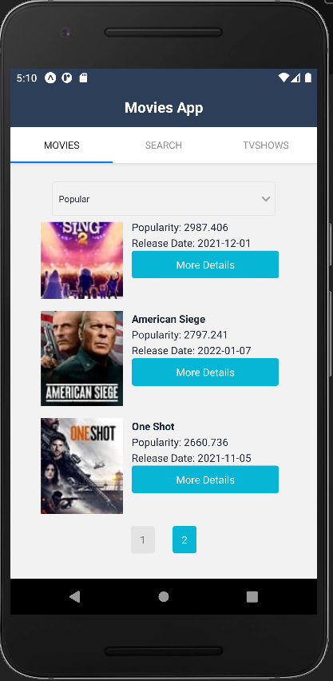
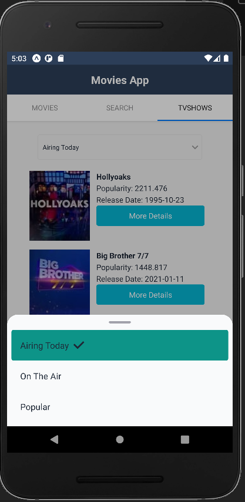

# Movies APP

  

# Table of Contents

- [Movies APP](#movies-app)
- [Table of Contents](#table-of-contents)
  - [About this App](#about-this-app)
  - [Tech Stack- Movies APP](#tech-stack--movies-app)
  - [Libraries](#libraries)
  - [Features:](#features)
  - [How to use](#how-to-use)
  - [More pics](#more-pics)

## About this App

This Mobile App was developed to show movies and TV Shows titles. It also allows the users to search by actress or title name.
  

## Tech Stack- [Movies APP](#movies-app)

Movies APP was developed using the following tech stack:

- 
  React Native

- 
  The Movie DB

   

## Libraries

- Expo
- Axios
- Native base
    

## Features:

**_Screens:_**   1. Movies: filter by Now playing, Popular, top rated, Upcoming   2. TV Shows by: filter by Airing today, On the air, Popular   3. Search: search by Movie, TV Show or both

**_Pagination:_**
This apps has pagination implemented splitting fetched data in 2 blocks of 10 items each. Response is based in the first page only (20 results).
  

## How to use

1. Clone RentMe repo by using https://github.com/alerika2018/movies-RN-App
2. Go to https://developers.themoviedb.org/3/getting-started/introduction and get an API key
3. Run npm install to get all dependencies
4. Add a file under the name apiKey.js inside the folder config
   - Write a single line: export const API_KEY = ""
   - Include your own API key from themoviedb.org
5. Run npm start
6. Enjoy!
     

## More pics

  

